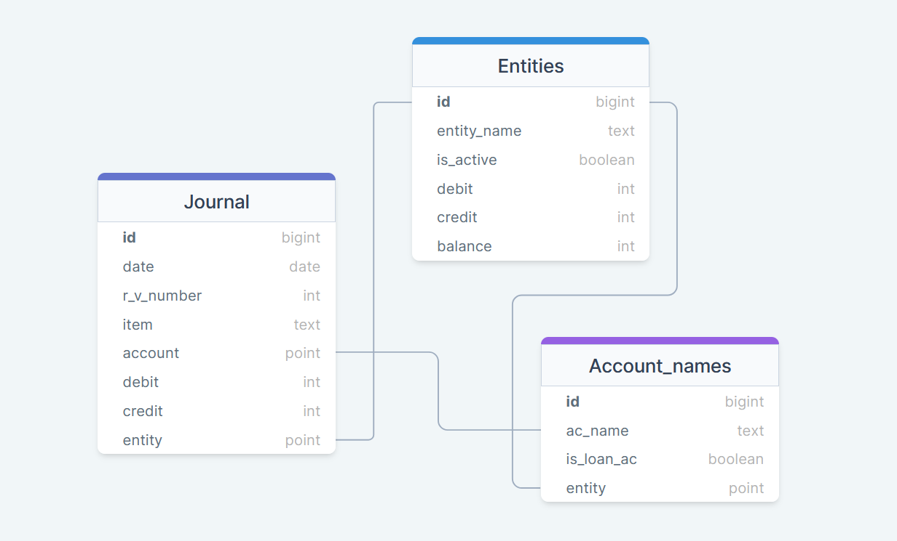

# 
 
<!-- 

  

 -->
<h1 align="center">Accounting App with django</h1>

# Live Demo 
<ul>
<li> Hosted on pythonanywhere <a href="https://mhdmak.pythonanywhere.com/">https://mhdmak.pythonanywhere.com/</a> [ username: abcdf, password: 1234 ]</li>
 </ul>
 
# About

An simple accounting web app built with python
<ul > 
 <li> Signin & signup authentication.</li> 
<b>For each Entity/bussiness can</b>
 <li> Record all transactions of a  multipl entity/bussiness etc.</li>
 <li> View journal, balance sheet (all/within specific date range)</li>
 <li> Print journal, balance sheet</li>

</ul>

# Table of URLs

<table>
<!--  <tr>
 <th></th> <th></th>
 </tr> -->
 <tr><td> edit transaction/<int:pk> </td></tr>
 <tr><td> add transaction/<str:entity_name> </td></tr>
 <tr><td> journal/<str:entity_name> </td></tr>
 <tr><td> balance sheet/<str:entity_name> </td></tr>
 <tr><td> register/</td></tr>
 <tr><td> login/</td></tr>
 <tr><td> logout </td></tr>
 <tr><td> index </td></tr>
</table>

# 🧱 Database Structure 

In this project there are mainly 3 database tables named <b>Entities, Account_names and Journal</b>

# ⛏️ Built With 

- [Sqlite](https://www.mongodb.com/) - Database
- [Django](https://expressjs.com/) - Web Backend Framework
- [Bootstrap](https://vuejs.org/) - Front-End

<!-- ## 📷 Screenshots

 -->
<!-- 

# 🎉 Acknowledgments 

- Tutorial followed : YesTech Media YouTube Channel
- Link : https://www.youtube.com/channel/UC8oGXh16q4YXnVPNrF3fE9w -->
